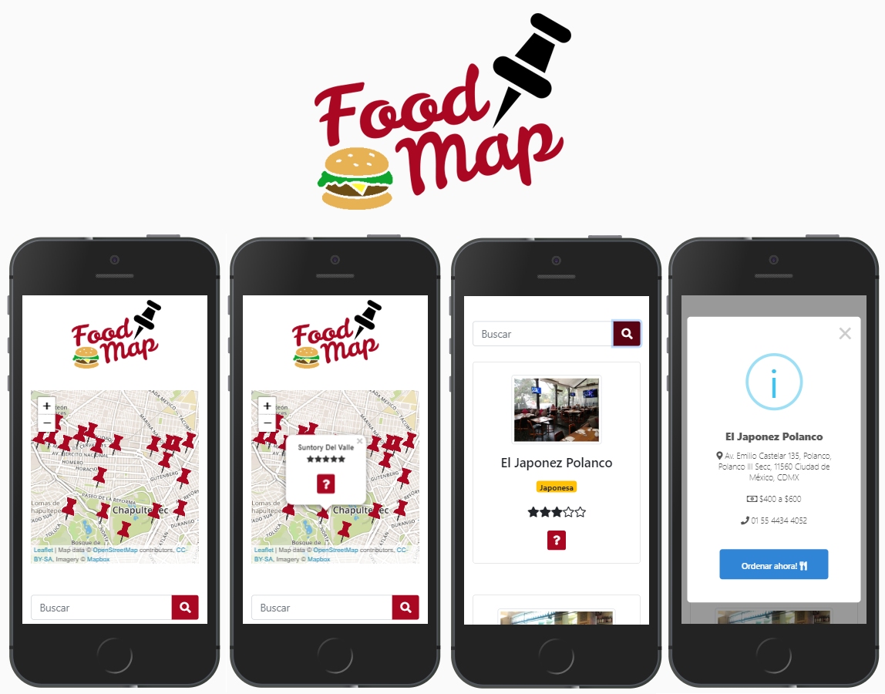

#  FoodMap
----
### Características
Esta aplicación web permite:
* Visualizar en un mapa los restaurantes de la zona.
* Acceder a la información de cada restaurante (dirección, teléfono, rango de precios, tipo de comida, calificación).
* Visualizar el listado de los restaurantes de la zona ordenados por calificación.
* Realizar búsquedas de restaurantes por nombre.

----
### Tecnologías
Para desarrollo de este proyecto se utilizaron las siguientes tecnologías y librerías:
1. HTML5
2. CSS3
3. JavaScript (ES6)
4. [Bootstrap 4.1](https://getbootstrap.com/)
5. [Sweet Alert](https://sweetalert2.github.io/)
6. [Firebase](https://firebase.google.com/)*
7. [Leaflet](https://leafletjs.com/)

*Los productos utilizados de firebase son: [Cloud Firestore](https://firebase.google.com/products/firestore/) para almacenar la data.

----
### Estructura del proyecto
La estructura de archivos del proyecto se muestra a continuación:

```text
./
├── .editorconfig
├── .eslintrc
├── .gitignore
├── README.md
├── package.json
├── package-lock.json
├── src
│   ├── css
│ 	│ 	├── style.css
│ 	│ 	├── queries.css
│   ├── js
│ 	│ 	├── firebase.js
│ 	│ 	├── main.js
│ 	│ 	├── map.js
│   ├── views
│ 	│ 	├── main.html
│   └── images
└── index.html
```
----
### Pantallas del proyecto
